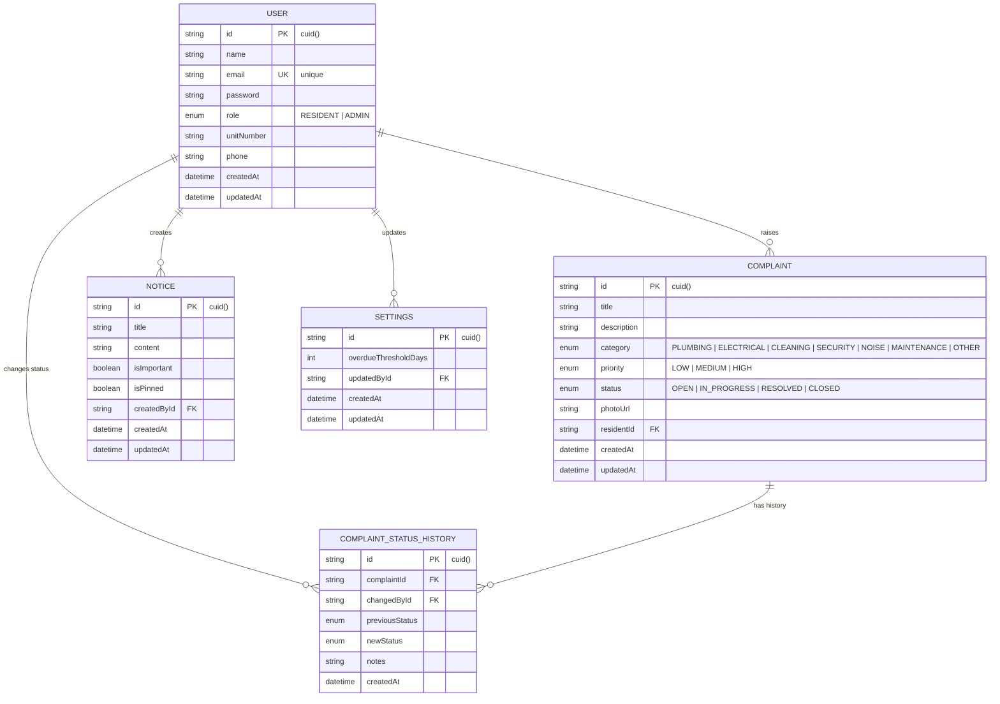

# Database & Schema Documentation

This document describes the relational database schema, entity models, relationships, data types, and index constraints for the **Society Maintenance Tracker**.

---

## 1. Entity-Relationship (ER) Diagram

---

## 2. Table Specifications

### 2.1 `User` Table
Stores user credentials, roles, and resident unit details.

| Field Name | Type | Constraints | Description |
| --- | --- | --- | --- |
| `id` | `String` | `@id`, `@default(cuid())` | Unique user identifier |
| `name` | `String` | Required | Full user name |
| `email` | `String` | `@unique`, Lowercase | User email address |
| `password` | `String` | Hashed (`bcryptjs`) | Password hash |
| `role` | `Enum (Role)` | `@default(RESIDENT)` | Access control role (`RESIDENT` or `ADMIN`) |
| `unitNumber` | `String?` | Optional | Apartment/Unit number (e.g. `A-102`) |
| `phone` | `String?` | Optional | Contact phone number |
| `createdAt` | `DateTime` | `@default(now())` | Creation timestamp |
| `updatedAt` | `DateTime` | `@updatedAt` | Auto-update timestamp |

---

### 2.2 `Complaint` Table
Stores maintenance complaints logged by residents.

| Field Name | Type | Constraints | Description |
| --- | --- | --- | --- |
| `id` | `String` | `@id`, `@default(cuid())` | Unique complaint ID |
| `title` | `String` | Required ($\ge 3$ chars) | Short complaint summary |
| `description` | `String` | Required ($\ge 10$ chars) | Detailed complaint description |
| `category` | `Enum (Category)` | `@default(OTHER)` | `PLUMBING`, `ELECTRICAL`, `CLEANING`, `SECURITY`, `NOISE`, `MAINTENANCE`, `OTHER` |
| `priority` | `Enum (Priority)` | `@default(MEDIUM)` | `LOW`, `MEDIUM`, `HIGH` |
| `status` | `Enum (Status)` | `@default(OPEN)` | `OPEN`, `IN_PROGRESS`, `RESOLVED`, `CLOSED` |
| `photoUrl` | `String?` | Optional | URL to Cloudinary image or local upload |
| `residentId` | `String` | `@relation(User)` | Foreign key referencing `User.id` |
| `createdAt` | `DateTime` | `@default(now())` | Logged timestamp |
| `updatedAt` | `DateTime` | `@updatedAt` | Last modification timestamp |

---

### 2.3 `ComplaintStatusHistory` Table
Stores immutable status transition history and audit notes.

| Field Name | Type | Constraints | Description |
| --- | --- | --- | --- |
| `id` | `String` | `@id`, `@default(cuid())` | Unique audit record ID |
| `complaintId` | `String` | `@relation(Complaint)` | Foreign key referencing `Complaint.id` (`onDelete: Cascade`) |
| `changedById` | `String` | `@relation(User)` | Foreign key referencing `User.id` (`onDelete: Cascade`) |
| `previousStatus` | `Enum?` | Optional | Complaint status prior to change |
| `newStatus` | `Enum` | Required | Complaint status after change |
| `notes` | `String?` | Optional | Admin notes or automated system notes |
| `createdAt` | `DateTime` | `@default(now())` | Timestamp of status change |

---

### 2.4 `Notice` Table
Stores society announcements and pinned notices.

| Field Name | Type | Constraints | Description |
| --- | --- | --- | --- |
| `id` | `String` | `@id`, `@default(cuid())` | Unique notice ID |
| `title` | `String` | Required | Notice header |
| `content` | `String` | Required | Detailed notice message |
| `isImportant` | `Boolean` | `@default(false)` | Flags notice for email broadcast |
| `isPinned` | `Boolean` | `@default(false)` | Pins notice to top of board |
| `createdById` | `String` | `@relation(User)` | Foreign key referencing admin `User.id` |
| `createdAt` | `DateTime` | `@default(now())` | Created timestamp |
| `updatedAt` | `DateTime` | `@updatedAt` | Updated timestamp |

---

### 2.5 `Settings` Table
Stores system-wide configurable parameters.

| Field Name | Type | Constraints | Description |
| --- | --- | --- | --- |
| `id` | `String` | `@id`, `@default(cuid())` | Unique settings record ID |
| `overdueThresholdDays` | `Int` | `@default(3)` | Days after creation before an open complaint is flagged as overdue |
| `updatedById` | `String?` | `@relation(User)` | Admin user who updated the settings |
| `createdAt` | `DateTime` | `@default(now())` | Creation timestamp |
| `updatedAt` | `DateTime` | `@updatedAt` | Last updated timestamp |

---

## 3. Enums

### `Role`
- `RESIDENT`: Standard society resident user
- `ADMIN`: Society management administrator

### `ComplaintCategory`
- `PLUMBING`, `ELECTRICAL`, `CLEANING`, `SECURITY`, `NOISE`, `MAINTENANCE`, `OTHER`

### `Priority`
- `LOW`, `MEDIUM`, `HIGH`

### `ComplaintStatus`
- `OPEN`, `IN_PROGRESS`, `RESOLVED`, `CLOSED`
